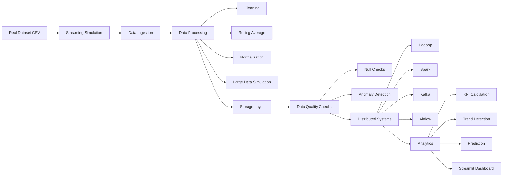
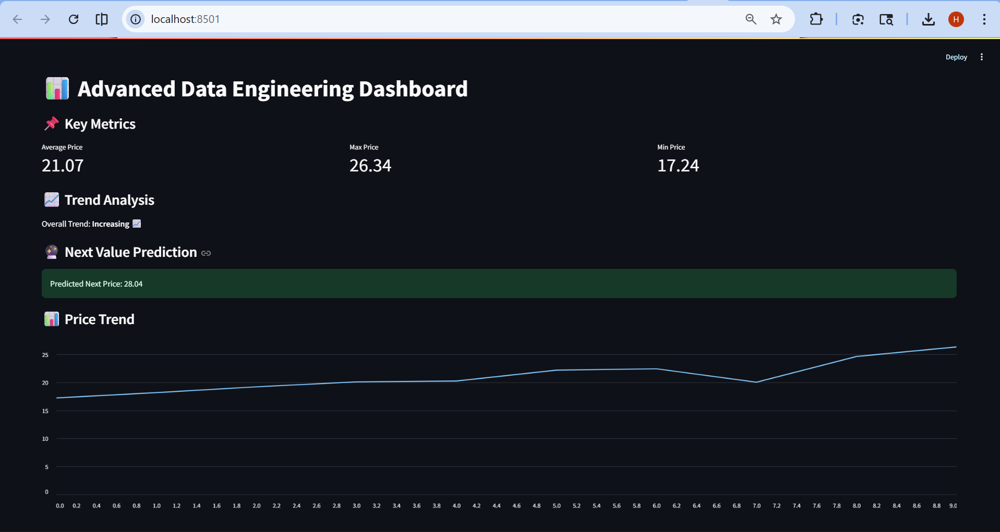
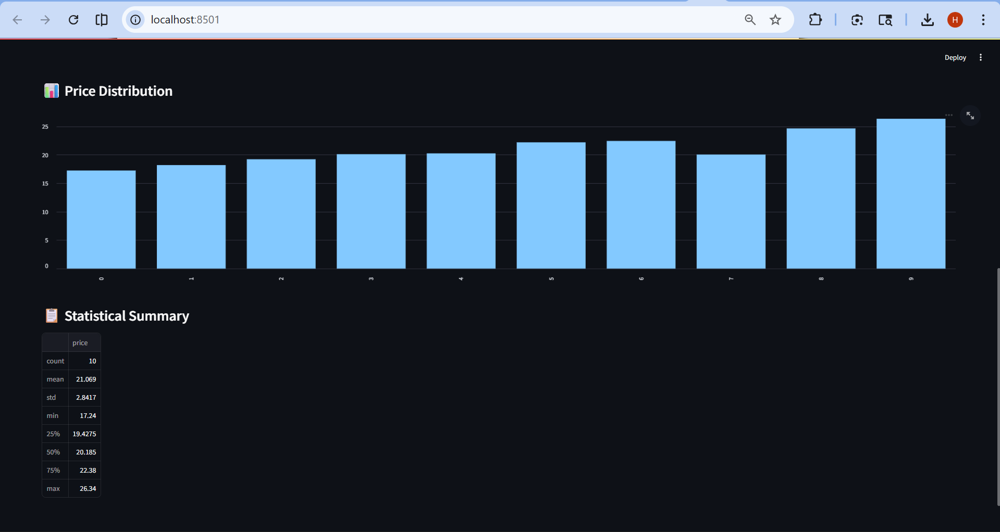

# 📊 Scalable Data Engineering Pipeline


---

## 🚀 Project Overview

The **Scalable Data Engineering Pipeline** is an end-to-end system that simulates real-world data workflows including ingestion, transformation, storage, validation, and visualization.

This project uses real financial data and demonstrates concepts like streaming, ETL/ELT, distributed systems, and analytics dashboards.

---

## 🏗️ System Architecture



---

## ⚙️ Tech Stack

### Programming
- Python

### Data Processing
- Pandas
- NumPy

### Visualization
- Streamlit

### Database
- SQLite

### Concepts
- ETL / ELT
- Data Warehousing
- Streaming Systems
- Distributed Systems (Simulated)
- Data Quality

---

## 📂 Project Structure

```
project/
│
├── data/
├── ingestion/
├── processing/
├── streaming/
├── sql/
├── etl_elt/
├── hadoop_sim/
├── spark_sim/
├── airflow_sim/
├── cloud/
├── lakehouse/
├── quality/
├── dashboard/
│
├── main.py
└── requirements.txt
```

---

## 🧠 Data Engineering Pipeline

### 1️⃣ Data Source
- Real financial dataset (CSV)

### 2️⃣ Streaming
- Simulated real-time data flow

### 3️⃣ Ingestion
- CSV loading and merging

### 4️⃣ Processing
- Cleaning
- Rolling average
- Normalization
- Data scaling

### 5️⃣ Storage
- CSV-based data lake

### 6️⃣ Quality Checks
- Null validation
- Anomaly detection

### 7️⃣ Distributed Systems (Simulated)
- Hadoop (splitting)
- Spark (processing)
- Kafka (streaming)
- Airflow (scheduling)

### 8️⃣ Analytics
- KPIs
- Trend detection
- Prediction

### 9️⃣ Visualization
- Streamlit dashboard

---
## 📊 Dashboard Preview

### 🔹 Key Metrics & Prediction


### 🔹 Distribution & Summary

---

## ▶️ Installation

```bash
git clone https://github.com/YOUR_USERNAME/YOUR_REPO.git
cd YOUR_REPO
pip install -r requirements.txt
```

---

## ▶️ Run Project

```bash
python streaming/stream.py
python main.py
streamlit run dashboard/app.py
```

---

## 🧪 Use Cases

- Data Engineering projects  
- Real-time pipeline simulation  
- Analytics dashboards  
- Academic submissions  

---

## 🔮 Future Improvements

- Real Kafka & Hadoop  
- Cloud deployment  
- Live APIs  
- ML predictions  

---

## 👨‍💻 Author

**Harsh Verma**

---

## 📜 License

This project is licensed under the MIT License.
